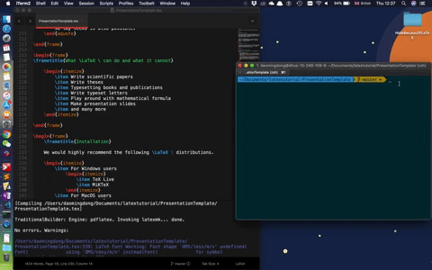

# LaTeX Tutorial CSSA Cambridge

[-blue.svg)](https://github.com/996icu/996.ICU/blob/master/LICENSE)
<a href="https://996.icu"></a>


This repo hosts the project files for a Latex Workshop presented by Daoming Dong (dd511, Darwin College) and Youchao Wang (yw479, Clare Hall) for CSSA Cambridge, UK, April 20th, 2019.

## A very important note

A special thanks to Dr Rich Wareham (github: rjw57) who responded to our "add a license request" in no time.

## Repository layout

`LaTeXTutorial.pdf`: The beamer slides used for the tutorial. Currently still WIP.

You may find all the source codes for the LaTeX presentation slides in the `BeamerSlides` folder. The main `.tex` file is `LaTeXTutorial.tex`. The easiest way to build the project is to use the following code (in your `bash`/`powershell` environment).

```
pdflatex LaTeXTutorial.tex
```



## Useful references

A University of Cambridge style beamer template can be found [here](https://github.com/rjw57/cambridge-beamer). The beamer presentation for this tutorial made use of this template.

A CUED (Engineering Department) PhD thesis template can be found [here](https://github.com/kks32/phd-thesis-template). A modified thesis template is available in the submodule.

A good one-hour LaTeX youtube video can be found [here](https://www.youtube.com/watch?v=VhmkLrOjLsw).

The Cambridge Computer Lab LaTeX tutorial slides by Dr Markus Kuhn can be found [here](https://www.cl.cam.ac.uk/teaching/1617/TeX+MATLAB/latex-slides.pdf). Some of the contents in the presentation were referenced from this source.

## Cloning the repository

Since this repo contains submodules, the ideal way of cloning this repository is:

```
git clone --recursive https://github.com/Siegfriedchao/LatexTutorialCSSACambridge.git
```

To update recursively, i.e. to pull the updates from the submodules

```
git pull --recurse-submodules
git submodule update --remote --recursive
```

Whenever you find yourself pulling an empty submodle folder, do not panic, all you need to do is:

```
git submodule update --init
```
